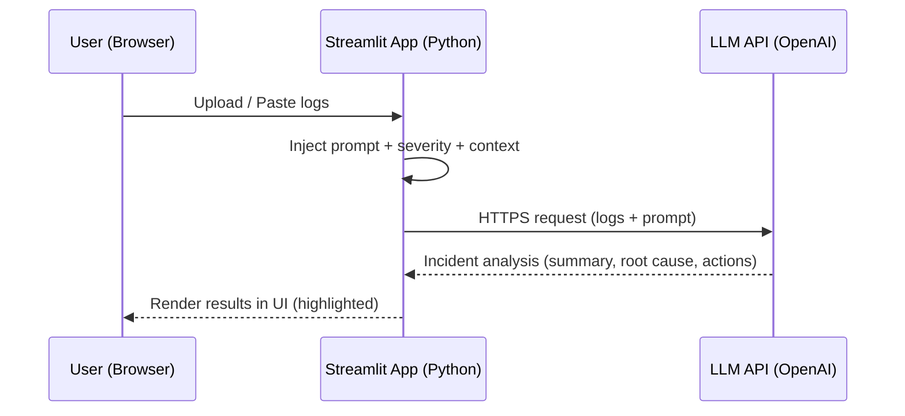

# LLM-Powered DevOps Copilot for Incident Triage

**What this is**
This project is a lightweight AI-powered assistant designed to help on-call engineers quickly understand incidents by analyzing logs or incident text and producing structured summaries, root cause hypotheses, and recommended actions.

**Problem**
During outages and incidents, engineers spend valuable time scanning logs and alerts just to understand:
1.What is happening
2.Why it might be happening
3.What to check first
4.This slows down response time and increases cognitive load.

**Solution**
DevOps Copilot takes:
Raw application logs
Incident descriptions

And produces:
A short summary
Likely root causes
Recommended next steps
A ready-to-use incident ticket draft

**Who this is for**
SRE / DevOps engineers
Support engineers (Tier 2 / Tier 3)
Platform teams

**What I tested**
I used structured prompting with a large language model to:
Extract incident context from logs
Suggest root cause patterns
Generate actionable remediation steps
All examples in this repo use realistic but synthetic logs inspired by real production systems.

**Example Output (Sample)**
**Summary**
Increased 500 errors on /api/v1/devices
Downstream service timing out
Circuit breaker activated

**Likely Causes**
Downstream service outage
Network connectivity issues
Database connection pool exhaustion

**Next Actions**
Check health of downstream service
Validate network latency and errors
Inspect DB connection limits

**Incident Ticket Draft**
Title: Device API failures due to downstream timeouts
Description: Errors began spiking at 10:52 UTC due to repeated request failures

**Limitations**
Responses may contain assumptions
AI output should not be used without human validation
Requires monitoring and guardrails in real deployments

**Roadmap**
Future enhancements may include:
CLI tool support
Log ingestion from files or paste input
JSON output format
Jira integration
API-based deployment

**Architecture Overview**
This application follows a lightweight client–server pattern using a local Python backend and a cloud-hosted LLM API.

**Description**
* **User Interface (Browser):**
The user pastes or uploads log files in the Streamlit web UI.
* **Application Layer (Streamlit Backend):**
The Python backend receives the logs, applies prompt logic based on selected incident type and severity, and formats the request for the LLM.
* **LLM Integration (OpenAI API):**
Logs and context are sent via HTTPS using the OpenAI SDK. The model (gpt-4o-mini) processes the incident and returns structured insights (summary, root cause, actions).
* **Response Rendering (Browser):**
The application renders highlighted, formatted output in real-time.

**Data Handling**
* Logs exist only in memory for the duration of a session.
* The application does not write any log files to disk or database.
* No user data is persisted.
* Each analysis request is stateless.
